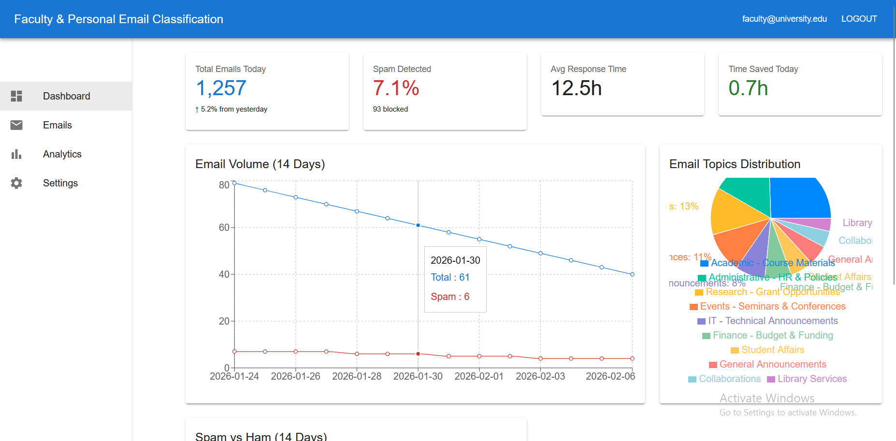
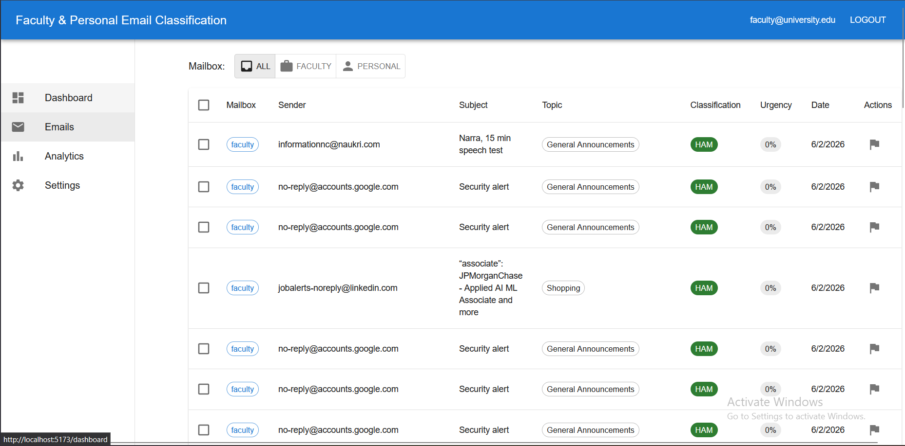
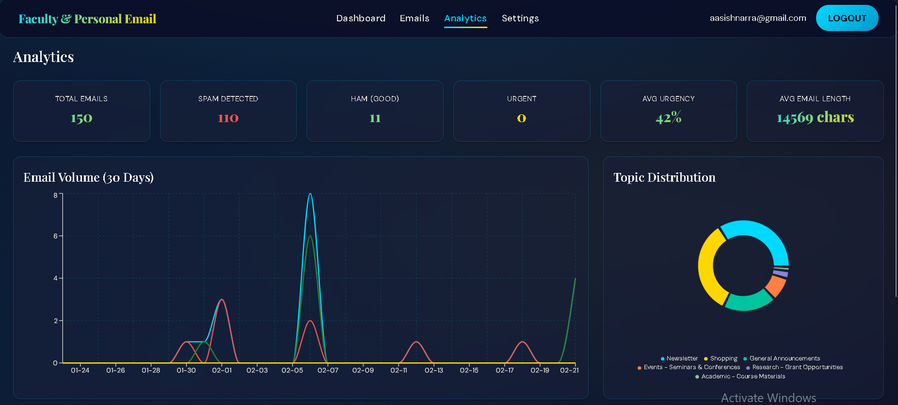
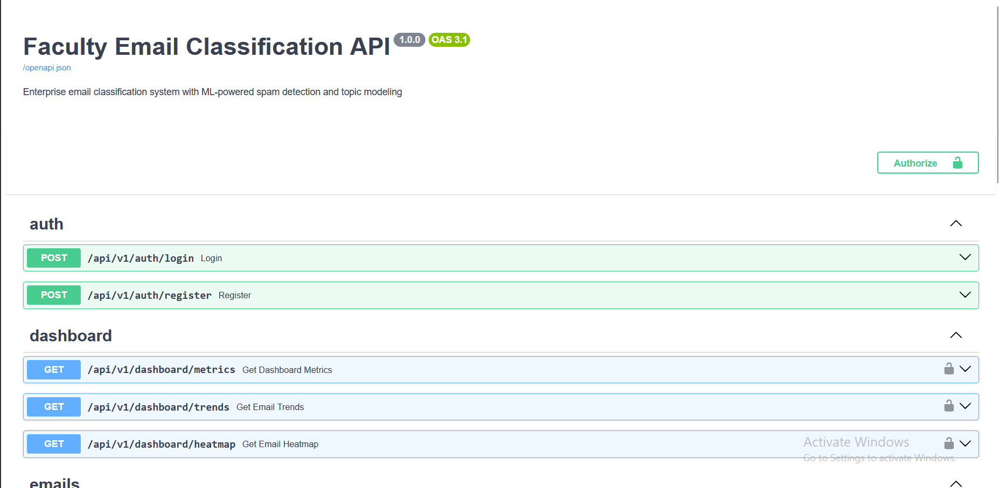
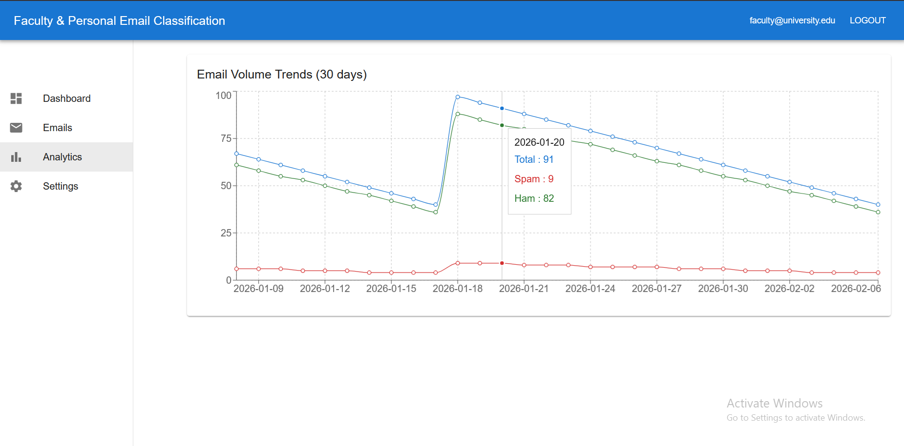

# 📬 AI-Powered Email Classifier

**Enterprise-grade email classification for faculty and personal inboxes.** Connect Gmail or Outlook, classify spam and topics, and manage everything from a single dashboard.

---

## Summary

The system helps faculty and staff manage high email volume by **classifying messages** (spam vs. ham, topics), **connecting real mailboxes** (Gmail/Outlook via IMAP), and **visualizing trends** in a web app. A FastAPI backend handles auth, metrics, and real-time sync; a React dashboard provides the UI. Optional data-pipeline and Spark components support batch processing and warehouse-style analytics.

---

## Dashboard

The **Dashboard** is the home view after login. It shows:

- **KPIs:** Total emails today, spam rate, average response time, and time saved by auto-classification.
- **Email volume:** Line chart of total and spam volume over time.
- **Topic distribution:** Pie chart of how emails are grouped (e.g. Academic, Administrative, Research, Events, IT, Finance, Student Affairs, General Announcements).
- **Spam vs ham:** Breakdown of spam versus legitimate mail.

Real-time metric updates can be delivered over WebSocket when the backend supports it.

---

## Emails

The **Emails** page lists classified messages in a table. You can:

- **Filter by mailbox:** All, Faculty, or Personal.
- **See per-email:** Mailbox type, sender, subject, topic tag, classification (HAM/SPAM), urgency, and date.
- **Open a row** for full body and details.
- **Reclassify** (e.g. mark as spam or not) to feed model improvement.

When a real mailbox is connected in Settings, this list is filled from your synced inbox; otherwise it shows demo or mock data.

---

## Analytics

The **Analytics** page focuses on trends over time:

- **Email volume trends (30 days):** Line chart of total, ham, and spam counts by day.
- Tooltips on the chart show exact counts for a given date.

This view helps spot patterns in volume and spam over the month.

---

## Settings

The **Settings** page is used to connect a real mailbox and control sync:

- **Real-time email (IMAP):** Connect Gmail or Outlook using an App Password (not your normal password). The UI shows connection status (e.g. “Connected: you@gmail.com”).
- **Sync now:** Manually trigger a sync of recent emails into the system; they then appear on the Emails page with classification.
- **Disconnect:** Remove the linked mailbox and stop syncing.

Notification and display preferences can be extended here later.

---

## API documentation

The backend exposes a REST API (auth, dashboard metrics, emails, mailbox connect/sync, WebSocket). Interactive **OpenAPI (Swagger)** docs are available at `/docs` when the API is running. There you can see all endpoints, try them with “Authorize” (JWT), and inspect request/response schemas.

---

## Big Data Analytics

When the big data stack is enabled (MinIO, Spark, Airflow, Kafka), the **Big Data Analytics** page (sidebar) shows pipeline status, data volume charts from Spark-computed analytics, model performance and history, storage partition explorer, and trigger controls for analytics refresh. See [docs/BIG_DATA_ARCHITECTURE.md](docs/BIG_DATA_ARCHITECTURE.md) for architecture and deployment.

---

## Tech stack

| Layer       | Technologies |
|------------|----------------|
| **Frontend** | React 18, TypeScript, Vite, Material UI, Redux Toolkit, Recharts |
| **Backend**  | FastAPI, Pydantic, SQLAlchemy (async), JWT, WebSockets |
| **Database** | SQLite (dev) / PostgreSQL; Redis optional for cache |
| **Data/ML**  | Spark (PySpark), Hive-style schema, ETL/ML pipeline stubs |
| **Big Data (optional)** | MinIO (S3), Kafka, Airflow, Spark cluster; `/api/v1/bigdata/` endpoints read from MinIO |

---

## License

Internal / university use.

---

**[GitHub](https://github.com/aasishchand/AI-Powered-Email-Classifier)**
